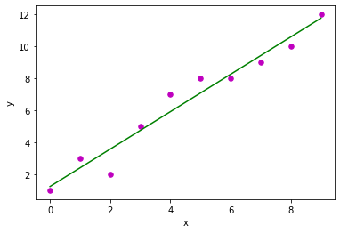
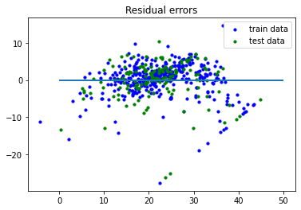

```python
import numpy as np
import matplotlib.pyplot as plt

```


```python

def estimate_coef(x,y):
    n=np.size(x)
    m_x=np.mean(x)
    m_y=np.mean(y)
    #clac cross deviation and deviation about x
    ss_xy=np.sum(y*x)-n*m_y*m_x
    ss_xx=np.sum(x*x)-n*m_x*m_x
    #calc regression coeef b0,b1
    b1=ss_xy/ss_xx
    b0=m_y-b1*m_x
    return b0,b1
def plot_regression_line(x,y,b):
    plt.scatter(x,y,color="m",marker="o",s=30)
    
    y_pred=b[0]+b[1]*x
    plt.plot(x,y_pred,color="g")
    plt.xlabel('x')
    plt.ylabel('y')
    plt.show()
    
def main():
    x=np.array([0,1,2,3,4,5,6,7,8,9])
    y=np.array([1,3,2,5,7,8,8,9,10,12])
    b=estimate_coef(x,y)
    print("estimated coeff's:\nb_0={}\\nb_1={}".format(b[0],b[1]))
    plot_regression_line(x,y,b)

if __name__ == "__main__":
    main()
    
```

    estimated coeff's:
    b_0=1.2363636363636363\nb_1=1.1696969696969697
    





```python
from sklearn import linear_model,metrics,datasets
```


```python
boston=datasets.load_boston(return_X_y=False)
```


```python
X=boston.data
y=boston.target
```


```python
from sklearn.model_selection import train_test_split
```


```python
X_train,X_test,y_train,y_test=train_test_split(X,y,test_size=0.3,random_state=0)
```


```python
reg=linear_model.LinearRegression()
```


```python
reg.fit(X_train,y_train)
plt.scatter(reg.predict(X_train),reg.predict(X_train)-y_train,color="blue",s=10,label="train data")
plt.scatter(reg.predict(X_test),reg.predict(X_test)-y_test,color="green",s=10,label="test data")
plt.hlines(y=0,xmin=0,xmax=50,linewidth=2)
plt.legend(loc="upper right")
plt.title("Residual errors")
plt.show()

```





```python

```


```python

```


```python

```


```python

```
